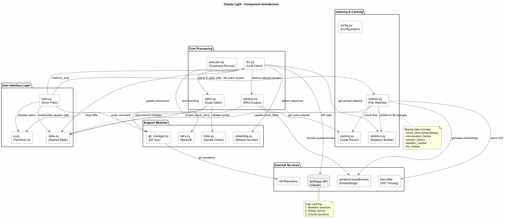
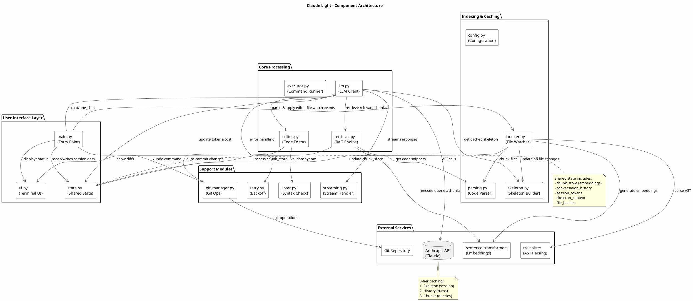
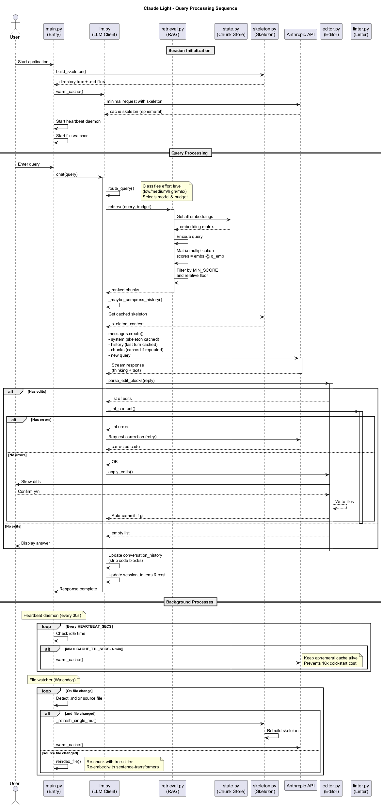
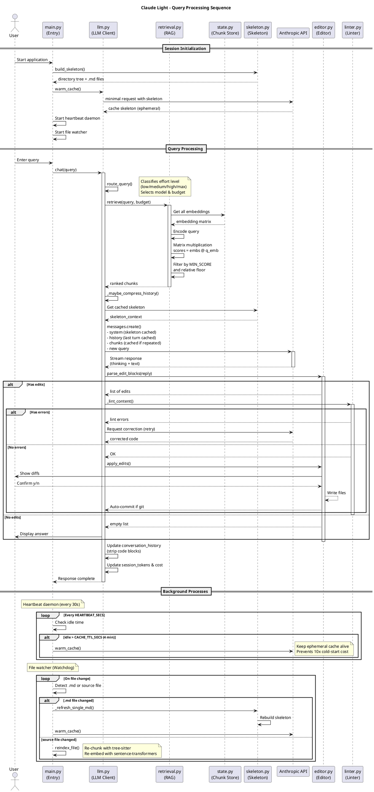
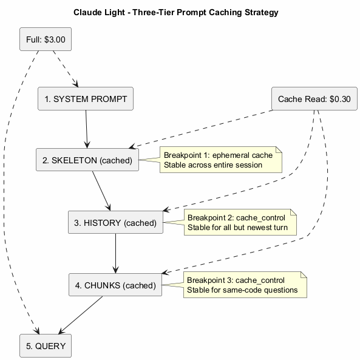
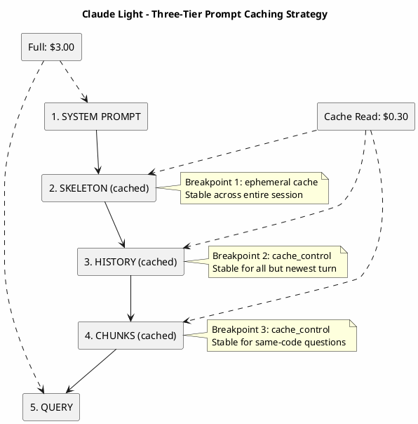
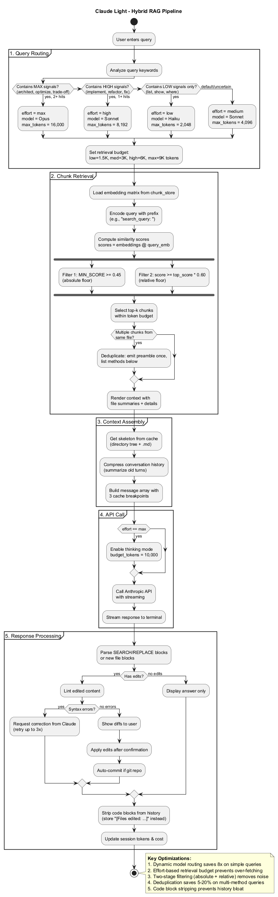
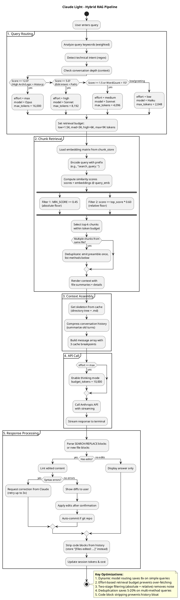
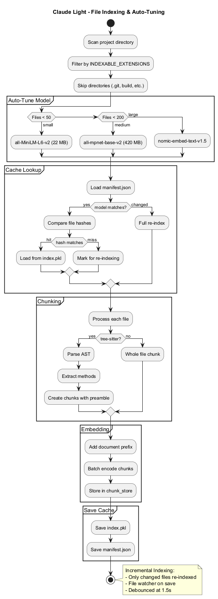
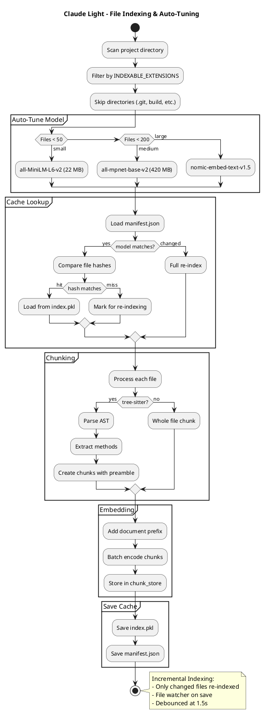

# Claude Light Architecture

This document provides a visual overview of the Claude Light architecture using PlantUML diagrams. Claude Light is an interactive CLI chat tool that combines Anthropic's prompt caching with a hybrid RAG (Retrieval-Augmented Generation) pipeline to drastically reduce API costs while maintaining full context of your codebase.

## Table of Contents

1. [Component Architecture](#component-architecture)
2. [Query Processing Sequence](#query-processing-sequence)
3. [Three-Tier Caching Strategy](#three-tier-caching-strategy)
4. [RAG Pipeline](#rag-pipeline)
5. [File Indexing Flow](#file-indexing-flow)

---

## Component Architecture

This diagram shows the main components and their relationships within Claude Light.



### Key Components

| Component | Responsibility |
|-----------|----------------|
| `main.py` | Entry point, orchestrates the chat loop and handles user commands |
| `llm.py` | LLM client, handles API calls, routing, and response processing |
| `retrieval.py` | RAG engine, performs similarity search and chunk selection |
| `editor.py` | Code editor, parses and applies SEARCH/REPLACE blocks |
| `indexer.py` | File watcher, manages incremental indexing and cache |
| `skeleton.py` | Builds compressed directory tree and markdown documentation |
| `state.py` | Shared state module for thread-safe access to session data |
| `config.py` | Configuration constants and API key resolution |

### External Dependencies

- **Anthropic API** - Claude models (Haiku, Sonnet, Opus)
- **sentence-transformers** - Text embeddings for RAG
- **tree-sitter** - AST parsing for method-level chunking
- **Git** - Version control for auto-commit feature

<details>
<summary>View PlantUML Source</summary>



</details>

---

## Query Processing Sequence

This sequence diagram illustrates the complete flow from user query to response, including background processes.



### Key Phases

1. **Session Initialization** - Build skeleton, index files, warm cache
2. **Query Routing** - Weighted scoring of intent, complexity, and context to select the most efficient model.
3. **Chunk Retrieval** - Find relevant code via embedding similarity
4. **Context Assembly** - Build message with cache breakpoints
5. **API Call** - Stream response from Claude
6. **Response Processing** - Parse edits, lint, apply changes

### Background Processes

- **Heartbeat Daemon** - Keeps cache warm every 30 seconds
- **File Watcher** - Re-indexes changed files automatically

### Interactive Commands

| Command | Description |
|---------|-------------|
| `/compact` or `/clear` | Reset conversation history |
| `/cost` | Show session spend so far |
| `/run <cmd>` | Run shell command and feed output to Claude |
| `/undo` | Undo the last git commit (revert AI changes) |
| `/help` | Display help menu |
| `exit` / `quit` | Quit the application |

<details>
<summary>View PlantUML Source</summary>



</details>

---

## Three-Tier Caching Strategy

Claude Light uses Anthropic's ephemeral caching with three strategic breakpoints to minimize costs.



### Cache Breakpoints

| Breakpoint | Location | Stable Across | Savings |
|------------|----------|---------------|---------|
| 1 | End of skeleton | Entire session | 90% off skeleton re-reads |
| 2 | End of history | All but newest turn | 90% off conversation history |
| 3 | End of chunks | Consecutive same-topic queries | 90% off retrieved context |

### Pricing (USD per 1M tokens)

| Type | Price |
|------|-------|
| Full Input | $3.00 |
| Cache Read | $0.30 (90% off) |
| Cache Write | $3.75 |
| Output | $15.00 |

<details>
<summary>View PlantUML Source</summary>



</details>

---

## RAG Pipeline

The Retrieval-Augmented Generation pipeline finds and injects only relevant code into the context.



### Key Optimizations

1. **Smarter Query Routing** - Weighted scoring (Arch vs Logic vs Infra) + context awareness
2. **Effort-Based Budget** - Low effort = 1.5K tokens, Max effort = 9K tokens
3. **Two-Stage Filtering** - Absolute floor (0.45) + Relative floor (60% of top score)
4. **Deduplication** - Shared preamble emitted once for multi-method results
5. **Code Block Stripping** - Edit blocks removed from history to prevent bloat

### Effort Levels

| Effort | Model | Max Tokens | Retrieval Budget | Thinking |
|--------|-------|------------|------------------|----------|
| low | Haiku | 2,048 | 1,500 | off |
| medium | Sonnet | 4,096 | 3,000 | off |
| high | Sonnet | 8,192 | 6,000 | off |
| max | Opus | 16,000 | 9,000 | on |

<details>
<summary>View PlantUML Source</summary>



</details>

---

## File Indexing Flow

The indexing system builds and maintains an incremental cache of code embeddings.



### Auto-Tuned Models

| Repo Size | Model | Size | Use Case |
|-----------|-------|------|----------|
| < 50 files | all-MiniLM-L6-v2 | 22 MB | Fast startup |
| 50-199 files | all-mpnet-base-v2 | 420 MB | Better depth |
| 200+ files | nomic-embed-text-v1.5 | 275 MB | Optimal recall |

### Method-Level Chunking

Instead of whole files, tree-sitter parses the AST and extracts individual methods:

```
chunk_id: filepath::methodName
text: // filepath
      package com.example;
      import java.util.*;
      
      public class Service {
          // ...
      }
      
      public ReturnType methodName(Args) {
          // method body
      }
```

**Benefits:**
- Self-contained: each chunk has full context
- Precise retrieval: fetch only relevant methods
- Deduplication: shared preamble emitted once
- Token efficiency: 5-10x reduction vs whole files

### Incremental Indexing

- Only changed files are re-chunked and re-embedded
- Cache is loaded on startup, avoiding redundant work
- File watcher triggers re-index on save
- Debounced at 1.5s to avoid rapid re-indexing

<details>
<summary>View PlantUML Source</summary>



</details>

---

## Related Documentation

- [README.md](../README.md) - Getting started and usage guide
- [Test Strategy](test_strategy.md) - Test suite architecture and CI/CD pipeline
- [CLAUDE.md](../CLAUDE.md) - Project guidelines and commands
