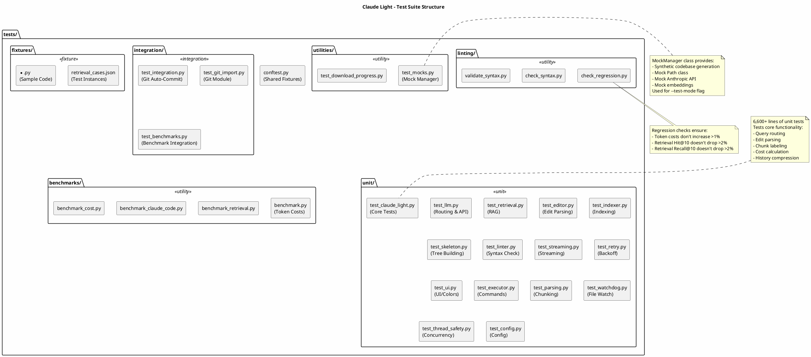
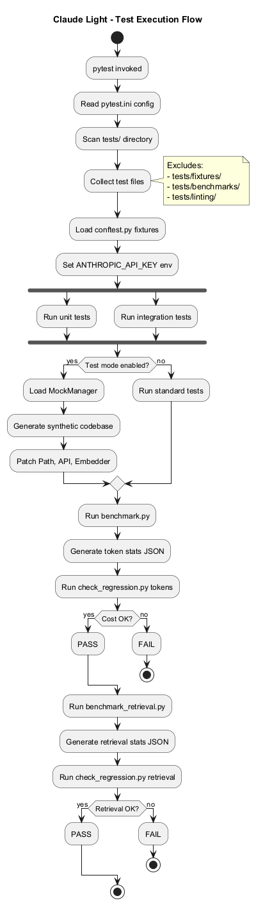
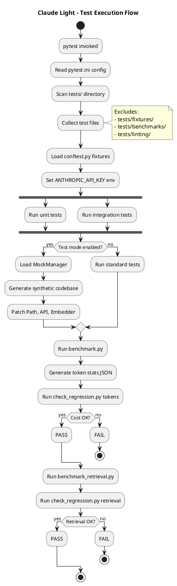
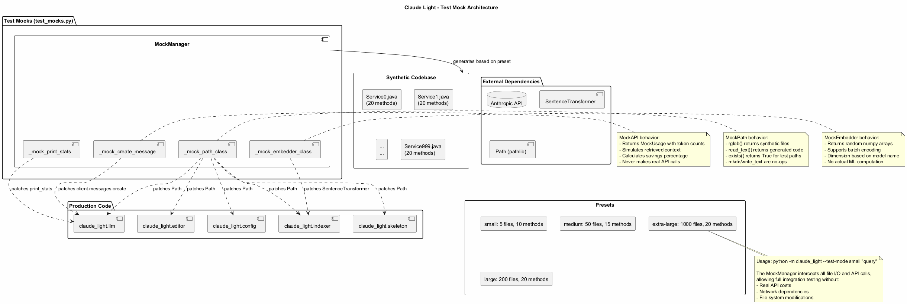
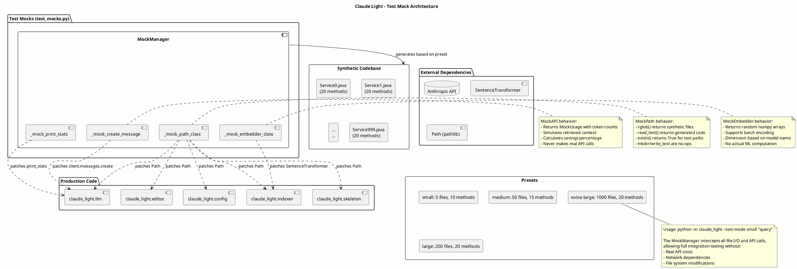
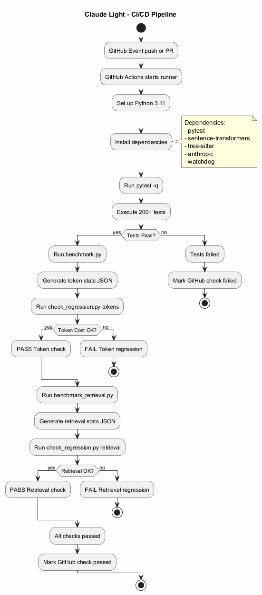
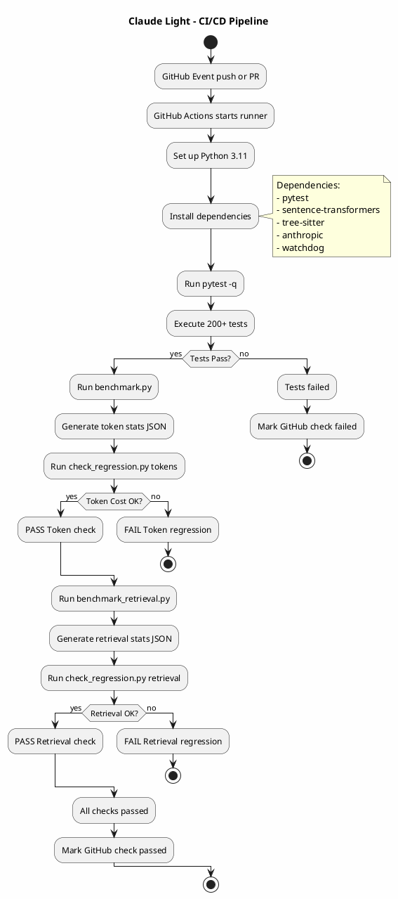

# Claude Light - Test Strategy

This document describes the testing strategy, architecture, and infrastructure for Claude Light. The test suite ensures code quality, prevents regressions, and validates the token optimization claims through automated regression checks.

## Table of Contents

1. [Test Suite Structure](#test-suite-structure)
2. [Test Execution Flow](#test-execution-flow)
3. [Mock Architecture](#mock-architecture)
4. [CI/CD Pipeline](#cicd-pipeline)
5. [Test Categories](#test-categories)
6. [Running Tests](#running-tests)

---

## Test Suite Structure

The test suite is organized into multiple directories, each serving a specific purpose.


### Directory Organization

| Directory | Purpose | Test Count |
|-----------|---------|------------|
| `tests/unit/` | Unit tests for individual modules | 17 files |
| `tests/integration/` | Integration tests for component interactions | 3 files |
| `tests/utilities/` | Test utilities and mock implementations | 2 files |
| `tests/linting/` | Regression check scripts | 3 files |
| `tests/benchmarks/` | Benchmark and regression test runners | 4 files |
| `tests/fixtures/` | Test data and fixtures | JSON files |

### Key Test Files

| File | Tests |
|------|-------|
| `test_claude_light.py` | Core functionality (6,600+ lines) |
| `test_llm.py` | Query routing, API calls, history compression |
| `test_retrieval.py` | RAG retrieval, deduplication, filtering |
| `test_editor.py` | Edit parsing, SEARCH/REPLACE, apply edits |
| `test_indexer.py` | File indexing, chunking, caching |
| `test_mocks.py` | MockManager for synthetic testing |

<details>
<summary>View PlantUML Source</summary>



</details>

---

## Test Execution Flow

The test execution follows a structured flow from discovery through regression checks.



### Execution Phases

1. **Discovery** - pytest scans `tests/` directory for `test_*.py` files
2. **Fixture Setup** - Load `conftest.py`, set environment variables
3. **Test Execution** - Run unit and integration tests in parallel
4. **Test Mode** - Optional synthetic codebase testing via `--test-mode`
5. **Regression Checks** - Validate token costs and retrieval quality

### pytest Configuration

```ini
# pytest.ini
[pytest]
testpaths = tests
python_files = test_*.py
python_classes = Test*
python_functions = test_*
addopts =
    -p no:doctest
    --ignore=tests/fixtures
    --ignore=tests/benchmarks
    --ignore=tests/linting
```

### Excluded Directories

| Directory | Reason |
|-----------|--------|
| `tests/fixtures/` | Contains test data, not test code |
| `tests/benchmarks/` | Run separately as regression checks |
| `tests/linting/` | Contains check scripts, not pytest tests |

<details>
<summary>View PlantUML Source</summary>



</details>

---

## Mock Architecture

The test suite includes a comprehensive mocking system for testing without API costs or external dependencies.



### MockManager Components

| Component | Purpose |
|-----------|---------|
| `_mock_path_class` | Mocks file system operations |
| `_mock_create_message` | Mocks Anthropic API calls |
| `_mock_embedder_class` | Mocks sentence-transformers |
| `_mock_print_stats` | Mocks statistics output |

### Synthetic Codebase Presets

| Preset | Files | Methods | Approx. Tokens |
|--------|-------|---------|----------------|
| `small` | 5 | 10 | ~5,000 |
| `medium` | 50 | 15 | ~50,000 |
| `large` | 200 | 20 | ~200,000 |
| `extra-large` | 1,000 | 20 | ~1,000,000 |

### Usage

```bash
# Run with synthetic codebase
python -m claude_light --test-mode small "List all public classes"
python -m claude_light --test-mode medium "Find the authentication module"
python -m claude_light --test-mode large "Explain the request handling flow"
```

### Mocked Behaviors

**MockPath:**
- `rglob()` returns synthetic files
- `read_text()` returns generated code
- `exists()` returns True for test paths
- `mkdir()`/`write_text()` are no-ops

**MockAPI:**
- Returns MockUsage with token counts
- Simulates retrieved context
- Calculates savings percentage
- Never makes real API calls

**MockEmbedder:**
- Returns random numpy arrays
- Supports batch encoding
- Dimension based on model name
- No actual ML computation

<details>
<summary>View PlantUML Source</summary>



</details>

---

## CI/CD Pipeline

GitHub Actions runs the full test suite on every push and pull request.



### Pipeline Stages

| Stage | Command | Purpose |
|-------|---------|---------|
| Setup | `actions/setup-python@v5` | Set up Python 3.11 |
| Install | `pip install ...` | Install all dependencies |
| Unit Tests | `pytest -q` | Run 200+ unit/integration tests |
| Token Regression | `benchmark.py` + `check_regression.py` | Validate token costs |
| Retrieval Regression | `benchmark_retrieval.py` + `check_regression.py` | Validate retrieval quality |

### Regression Thresholds

| Metric | Threshold | Failure Condition |
|--------|-----------|-------------------|
| Token Costs | Max 1% increase | `current > baseline * 1.01` |
| Hit@10 | Max 2% decrease | `current < baseline - 0.02` |
| Recall@10 | Max 2% decrease | `current < baseline - 0.02` |

### Baseline Files

| File | Content | Update Method |
|------|---------|---------------|
| `tests/baseline_token_stats.json` | Token cost benchmarks | Run `benchmark.py --json` |
| `tests/baseline_retrieval_stats.json` | Retrieval quality metrics | Run `benchmark_retrieval.py` |

### GitHub Actions Workflow

```yaml
# .github/workflows/test.yml
name: Test Suite

on:
  push:
    branches: ["main"]
  pull_request:
    branches: ["main"]

jobs:
  test:
    runs-on: ubuntu-latest
    strategy:
      matrix:
        python-version: ["3.11"]

    steps:
    - uses: actions/checkout@v4
    - name: Set up Python
      uses: actions/setup-python@v5
      with:
        python-version: ${{ matrix.python-version }}
    - name: Install dependencies
      run: |
        pip install pytest sentence-transformers tree-sitter-* ...
    - name: Run unit tests
      run: python -m pytest -q
    - name: Token regression check
      run: |
        python tests/benchmark.py --json > tests/baseline_token_stats_new.json
        python tests/check_regression.py tokens tests/baseline_token_stats.json tests/baseline_token_stats_new.json
    - name: Retrieval regression check
      run: |
        python tests/benchmark_retrieval.py --fixture tests/fixtures/retrieval_cases.json --output tests/baseline_retrieval_stats_new.json
        python tests/check_regression.py retrieval tests/baseline_retrieval_stats.json tests/baseline_retrieval_stats_new.json
```

<details>
<summary>View PlantUML Source</summary>



</details>

---

## Test Categories

### Unit Tests

Unit tests verify individual module functionality in isolation.

**Coverage:**
- Query routing logic
- Edit block parsing
- Chunk labeling
- Cost calculation
- History compression
- Skeleton building
- Linting functions
- Retry backoff
- UI formatting

**Example Test:**
```python
def test_route_query():
    # Low effort (simple lookups)
    model, effort, tokens = route_query("list all files")
    assert effort == "low"
    
    # Max effort (complex architectural reasoning)
    model, effort, tokens = route_query(
        "evaluate the scalability trade-offs deeply"
    )
    assert effort == "max"
```

### Integration Tests

Integration tests verify component interactions.

**Coverage:**
- Git auto-commit feature
- Git module imports
- Benchmark integration

**Example Test:**
```python
# test_integration.py - Git Auto-Commit
functions = [
    ('is_git_repo', callable),
    ('get_git_root', callable),
    ('auto_commit', callable),
    ('undo_last_commit', callable),
]

for func_name, _ in functions:
    assert hasattr(git_manager, func_name)
    assert callable(getattr(git_manager, func_name))
```

### Regression Tests

Regression tests ensure performance doesn't degrade.

**Token Regression:**
- Analytical cost model
- Compares warm session costs
- Validates RAG savings claims

**Retrieval Regression:**
- Uses SWE-bench fixtures
- Measures Hit@K and Recall@K
- Validates retrieval quality

---

## Running Tests

### Basic Test Run

```bash
# Run all tests
python -m pytest -q

# Run with verbose output
python -m pytest -v

# Run specific test file
python -m pytest tests/unit/test_llm.py -v

# Run specific test class
python -m pytest tests/unit/test_llm.py::TestRouteQuery -v

# Run specific test function
python -m pytest tests/unit/test_llm.py::TestRouteQuery::test_low_effort_simple_lookup -v
```

### Test Mode (Synthetic Codebase)

```bash
# Small synthetic codebase
python -m claude_light --test-mode small "List all public classes"

# Medium synthetic codebase
python -m claude_light --test-mode medium "Find authentication module"

# Large synthetic codebase
python -m claude_light --test-mode large "Explain request handling"

# Extra-large synthetic codebase
python -m claude_light --test-mode extra-large "Analyze architecture"
```

### Benchmark and Regression

```bash
# Generate token stats
python tests/benchmark.py --json > tests/baseline_token_stats_new.json

# Check token regression
python tests/check_regression.py tokens tests/baseline_token_stats.json tests/baseline_token_stats_new.json

# Generate retrieval stats
python tests/benchmark_retrieval.py --fixture tests/fixtures/retrieval_cases.json --output tests/baseline_retrieval_stats_new.json

# Check retrieval regression
python tests/check_regression.py retrieval tests/baseline_retrieval_stats.json tests/baseline_retrieval_stats_new.json
```

### Coverage Report

```bash
# Run with coverage
python -m pytest --cov=claude_light --cov-report=html

# View coverage report
open htmlcov/index.html  # macOS
xdg-open htmlcov/index.html  # Linux
start htmlcov/index.html  # Windows
```

---

## Related Documentation

- [README.md](../README.md) - Getting started and usage
- [Architecture](architecture.md) - System architecture diagrams
- [CLAUDE.md](../CLAUDE.md) - Project guidelines
